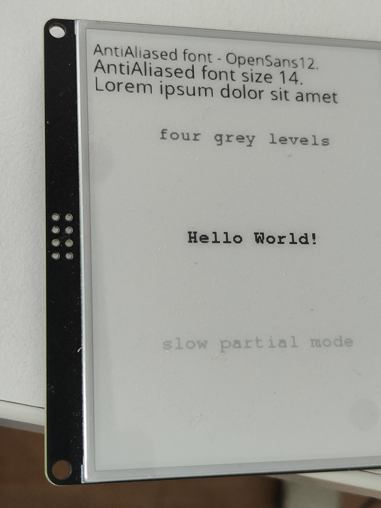

# GxEPD2_4G_ext
### An example which adds Anti-Aliased Font use to GxEPD2_4G library

Based on "GxEPD2_4G_MixedExample" from library [GxEPD2_4G_ext by ZinggJM](https://github.com/ZinggJM/GxEPD2_4G)

Tested with Waveshare ESP32 S3 Nano board and with WeAct Studio 4.2" epaper module.
*********************************

### Usage:

Download and copy all files in folder "EPD2_4G_MixedExample_ext" under your Arduino folder, in Windows it's typically ...Documents\Arduino\EPD2_4G_MixedExample_ext\
Then you can open, compile and upload the example to your ESP32 board. 

There are a few differences compared to the original EPD2_4G_MixedExample_ext example:
- Class "GxEPD2_4G_ext" ---> object "display" defined in the project's H file
- Class adds a new method (function) setAAFont, while original method setFont() of GxEPD2_4G remains intact
- Class adds a new function drawAAFontChar()  and printAA()

*********************************
Example is provided "as is", please do not expect any further documentation or any support.

